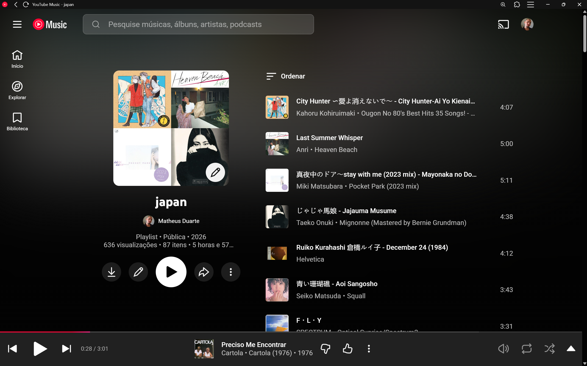
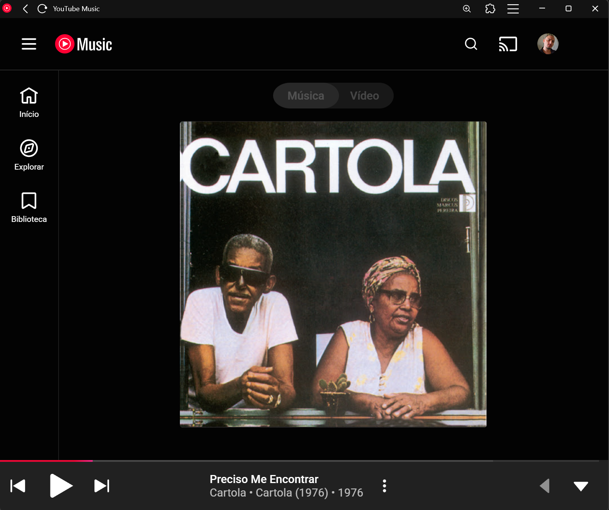
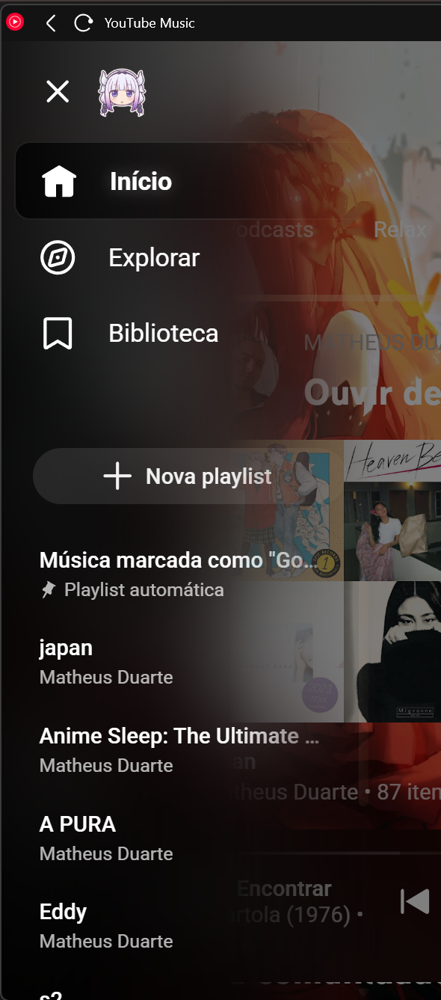
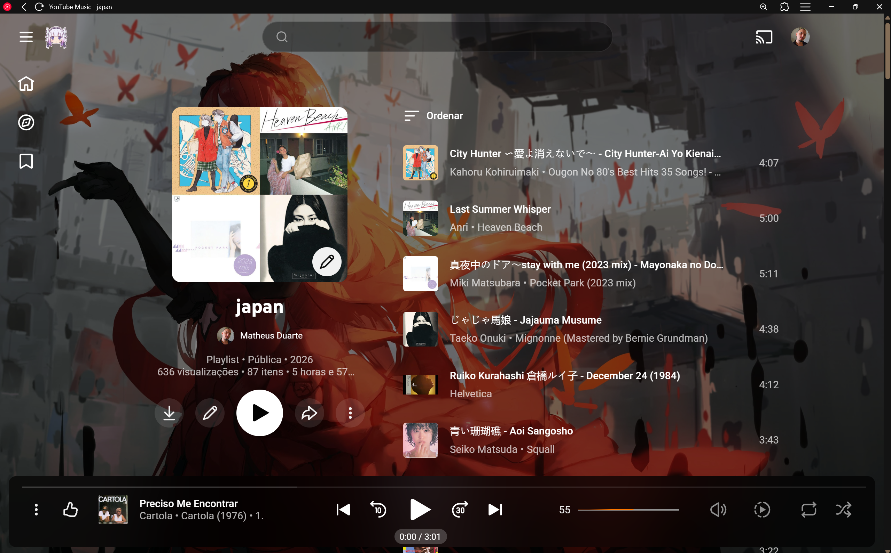
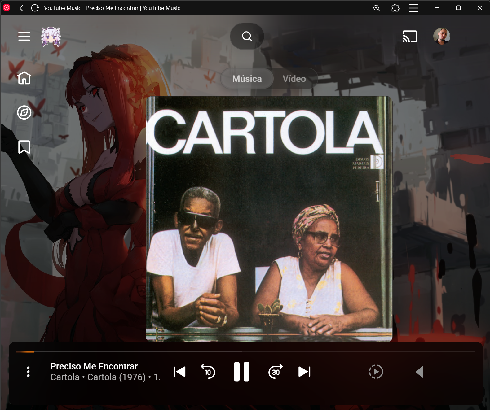

# YouTube Music Custom by AstroAstral

**Status: Alpha**

UserStyle desenvolvido para a extensão **Stylus**, focado em customização visual
avançada do YouTube Music (fundo dinâmico, blur/vidro, player customizado,
barra de progresso avançada e ajustes de UI/UX).

🔗 **Disponível no em:**  https://userstyles.world/style/25762/youtube-music-custom-alpha-version

## Preview

## Before / After

### Before (YouTube Music padrão)

### After (YouTube Music Custom by AstroAstral)

## Requisitos
- Navegador Chromium-based (testado no Brave)
- Extensão Stylus

## Instalação
1. Instale a extensão Stylus
2. Instale em https://userstyles.world/style/25762/youtube-music-custom-alpha-version
3. Aplique no navegador

## Observação
O desenvolvimento deste projeto contou com o apoio de ferramentas de IA
como auxílio para prototipação, ajustes visuais e refinamento do código.
Todas as decisões finais, integrações e manutenção foram feitas manualmente.

## Status
Este projeto está em fase **alpha**.
Mudanças estruturais e refatorações ainda podem ocorrer.

## Roadmap
- [ ] Refatorar estrutura do CSS
- [ ] Remover regras duplicadas
- [ ] Modularizar variáveis globais
- [ ] Versão Beta

> Nota: este projeto utilizou ferramentas de IA como apoio ao desenvolvimento.
